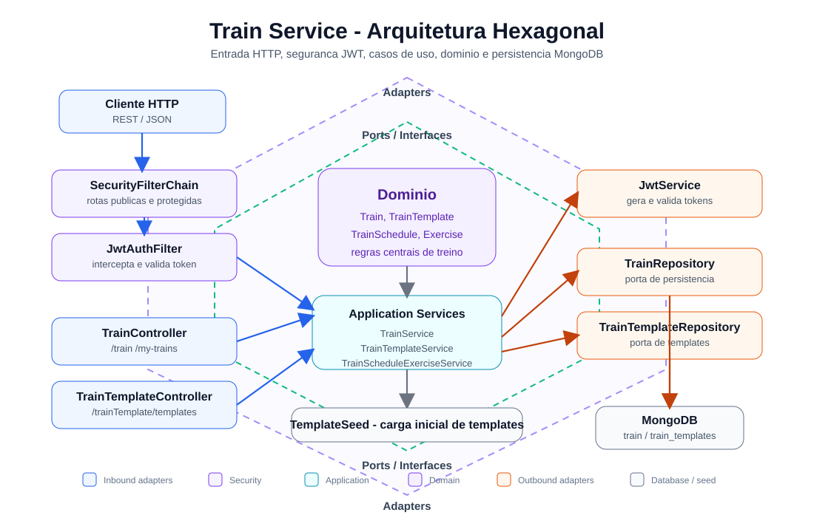

 # 🏋️ Train Service

API REST para gerenciamento de treinos, templates de treino, agenda semanal e exercicios de atletas. O servico foi construido com Java 21, Spring Boot, MongoDB e autenticacao via JWT.

## Indice

- Tecnologias
- Arquitetura
- Rodando localmente
- Docker
- Kubernetes com Minikube
- SonarCloud / SonarQube
- Swagger
- Endpoints
- Exemplos de uso
- Autor

## Tecnologias

- Java 21
- Spring Boot 3.4.1
- Spring Web
- Spring Security + JWT
- Spring Data MongoDB
- Spring Actuator
- Prometheus / Micrometer
- Swagger / OpenAPI
- Maven
- Docker
- Kubernetes
- SonarCloud / SonarQube

## Arquitetura

O projeto segue uma organizacao inspirada em Arquitetura Hexagonal, separando entrada HTTP, regras de aplicacao, dominio e infraestrutura.



```text
src/main/java/com/trainday/train
├── TrainApplication.java
├── api
│   ├── controller
│   │   ├── TrainController.java
│   │   └── TrainTemplateController.java
│   └── DTO/request
│       ├── ExerciseRequest.java
│       ├── TrainRequest.java
│       └── TrainScheduleRequest.java
├── application
│   ├── TrainScheduleExerciseService.java
│   ├── TrainService.java
│   └── TrainTemplateService.java
├── domain
│   ├── models
│   │   ├── Exercise.java
│   │   ├── Train.java
│   │   ├── TrainSchedule.java
│   │   └── TrainTemplate.java
│   └── repository
│       ├── TrainRepository.java
│       └── TrainTemplateRepository.java
└── infra
    ├── security
    │   ├── JwtAuthFilter.java
    │   ├── JwtService.java
    │   ├── SecurityConfig.java
    │   └── SwaggerConfig.java
    └── seed
        └── TemplateSeed.java
```

Responsabilidades principais:

- `api`: recebe requisicoes HTTP e delega para a camada de aplicacao.
- `application`: concentra regras de criacao, atualizacao, aplicacao de templates e alteracao de schedules/exercicios.
- `domain`: representa os modelos `Train`, `TrainTemplate`, `TrainSchedule` e `Exercise`.
- `infra`: integra seguranca, JWT, seed de dados e detalhes externos.

## Rodando localmente

```bash
git clone https://github.com/Danielpernnasc/treino-service.git
cd treino-service

export MONGODB_URI=mongodb://localhost:27017/train-service
export JWT_SECRET=sua-chave-secreta-super-segura

./mvnw spring-boot:run
```

A API estara disponivel em:

```text
http://localhost:8081
```

## Docker

### Dockerfile

O projeto ja possui um `Dockerfile` na raiz:

```dockerfile
FROM eclipse-temurin:21-jdk-alpine AS build
WORKDIR /app
COPY . .
RUN ./mvnw clean package -DskipTests

FROM eclipse-temurin:21-jre-alpine
WORKDIR /app
COPY --from=build /app/target/*.jar app.jar
EXPOSE 8081
ENTRYPOINT ["java", "-jar", "app.jar"]
```

### Comandos Docker

```bash
docker build -t train-service:latest .

docker run -p 8081:8081 \
  -e MONGODB_URI=mongodb://host.docker.internal:27017/train-service \
  -e JWT_SECRET=sua-chave-secreta-super-segura \
  train-service:latest

docker ps
docker logs <container_id>
docker stop <container_id>
```

### Docker Compose

O projeto possui `docker-compose.yml` usando `.env`:

```yaml
services:
  train-service:
    build: .
    ports:
      - "8081:8081"
    environment:
      - MONGODB_URI=${MONGODB_URI}
      - JWT_SECRET=${JWT_SECRET}
    env_file:
      - .env
```

Exemplo de `.env`:

```env
MONGODB_URI=mongodb://host.docker.internal:27017/train-service
JWT_SECRET=sua-chave-secreta-super-segura
```

Subir e parar:

```bash
docker-compose up -d
docker-compose down
```

## Kubernetes com Minikube

### Pre-requisitos

```bash
minikube start
kubectl version --client
```

### Manifests Kubernetes

Estrutura sugerida:

```text
k8s/
├── secret.yaml
├── deployment.yaml
└── service.yaml
```

`k8s/secret.yaml`

```yaml
apiVersion: v1
kind: Secret
metadata:
  name: train-service-secrets
type: Opaque
stringData:
  MONGODB_URI: mongodb://mongo-service:27017/train-service
  JWT_SECRET: sua-chave-secreta-super-segura
```

`k8s/deployment.yaml`

```yaml
apiVersion: apps/v1
kind: Deployment
metadata:
  name: train-service
  labels:
    app: train-service
spec:
  replicas: 1
  selector:
    matchLabels:
      app: train-service
  template:
    metadata:
      labels:
        app: train-service
    spec:
      containers:
        - name: train-service
          image: train-service:latest
          imagePullPolicy: Never
          ports:
            - containerPort: 8081
          envFrom:
            - secretRef:
                name: train-service-secrets
          readinessProbe:
            httpGet:
              path: /actuator/health
              port: 8081
            initialDelaySeconds: 20
            periodSeconds: 10
          livenessProbe:
            httpGet:
              path: /actuator/health
              port: 8081
            initialDelaySeconds: 30
            periodSeconds: 15
```

`k8s/service.yaml`

```yaml
apiVersion: v1
kind: Service
metadata:
  name: train-service
spec:
  selector:
    app: train-service
  type: NodePort
  ports:
    - port: 80
      targetPort: 8081
      nodePort: 30081
```

### Deploy no Minikube

```bash
eval $(minikube docker-env)

docker build -t train-service:latest .

kubectl apply -f k8s/secret.yaml
kubectl apply -f k8s/deployment.yaml
kubectl apply -f k8s/service.yaml

kubectl get pods
kubectl get services

minikube service train-service --url
kubectl logs -f deployment/train-service

kubectl delete -f k8s/
```

## SonarCloud / SonarQube

O `pom.xml` ja possui configuracao para SonarCloud:

```xml
<sonar.projectKey>Danielpernnasc_treino-service</sonar.projectKey>
<sonar.organization>danielpernnasc</sonar.organization>
<sonar.host.url>https://sonarcloud.io</sonar.host.url>
```

Rodar analise:

```bash
./mvnw verify sonar:sonar \
  -Dsonar.projectKey=Danielpernnasc_treino-service \
  -Dsonar.organization=danielpernnasc \
  -Dsonar.host.url=https://sonarcloud.io \
  -Dsonar.token=SEU_TOKEN_AQUI
```

Para SonarQube local:

```bash
docker run -d \
  --name sonarqube \
  -p 9000:9000 \
  sonarqube:lts-community
```

Depois acesse:

```text
http://localhost:9000
```

## Swagger

Com a aplicacao rodando:

```text
http://localhost:8081/swagger-ui/index.html
http://localhost:8081/v3/api-docs
```

## Endpoints

| Metodo | Rota | Autenticacao | Descricao |
|---|---|---|---|
| GET | `/train/my-trains` | Publica | Lista treinos cadastrados |
| POST | `/train` | Bearer Token | Cria um treino para o atleta autenticado |
| GET | `/train/my-trains/{id}` | Bearer Token | Busca treino por ID |
| PATCH | `/train/my-trains/{id}` | Bearer Token | Atualiza parcialmente um treino |
| PUT | `/train/my-trains/{id}` | Bearer Token | Atualiza um treino |
| DELETE | `/train/my-trains/{id}` | Bearer Token | Remove um treino |
| PATCH | `/train/my-trains/{id}/schedule/{index}` | Bearer Token | Atualiza um dia/schedule do treino |
| PATCH | `/train/my-trains/{id}/schedule/{scheduleIndex}/exercise/{exerciseIndex}` | Bearer Token | Atualiza um exercicio dentro do schedule |
| GET | `/trainTemplate/templates` | Publica | Lista templates de treino |
| POST | `/trainTemplate/templates/{id}/apply` | Bearer Token | Aplica um template ao atleta autenticado |
| GET | `/actuator/health` | Bearer Token | Health check da aplicacao |
| GET | `/actuator/prometheus` | Bearer Token | Metricas Prometheus |
| GET | `/swagger-ui/**` | Publica | Interface Swagger |
| GET | `/v3/api-docs/**` | Publica | Documentacao OpenAPI |

## Exemplos de uso

### Criar treino

```bash
curl -X POST http://localhost:8081/train \
  -H "Authorization: Bearer SEU_TOKEN_JWT" \
  -H "Content-Type: application/json" \
  -d '{
    "nameTrain": "Push Day",
    "category": "Hypertrophy",
    "description": "Peito, ombro e triceps",
    "schedules": [
      {
        "weekday": "Monday",
        "musclegroup": "Chest and Triceps",
        "emphasis": "Strength",
        "exercises": [
          {
            "nameExercise": "Bench Press",
            "series": 4,
            "repetitions": 8,
            "breakTime": "90s",
            "observation": "Carga progressiva"
          }
        ]
      }
    ]
  }'
```

### Listar templates

```bash
curl http://localhost:8081/trainTemplate/templates
```

### Aplicar template

```bash
curl -X POST http://localhost:8081/trainTemplate/templates/1/apply \
  -H "Authorization: Bearer SEU_TOKEN_JWT"
```

## Autor

Daniel Pericles  
GitHub: https://github.com/Danielpernnasc
